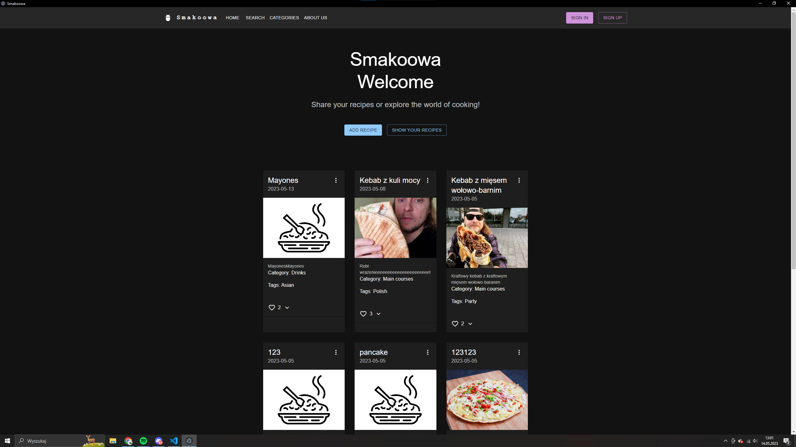

# Smakoowa Desktop

This cross-platform culinary application allows users to explore, rate, and contribute to a community-driven recipe database. With CRUD capabilities, users can easily manage their favorite recipes. My contribution was developing the desktop version using Electron, ensuring feature parity with the mobile and web versions.

## Features

- **Recipe Search**: Find recipes by name.
- **Recipe Tags**: Categorize recipes for easy navigation.
- **Recipe Rating**: Like recipes and add them to your favorites.
- **Comments**: Engage with the community.

## Development Setup

This project is built using React, Electron, Vite, React Router, and Webpack.

### Recommended IDE Setup

- VSCode
- ESLint
- Prettier

### Project Installation

```bash
npm install

Running in Development Mode
npm run dev

Building the Application
# For Windows
npm run build:win

# For macOS
npm run build:mac

# For Linux
npm run build:linux


